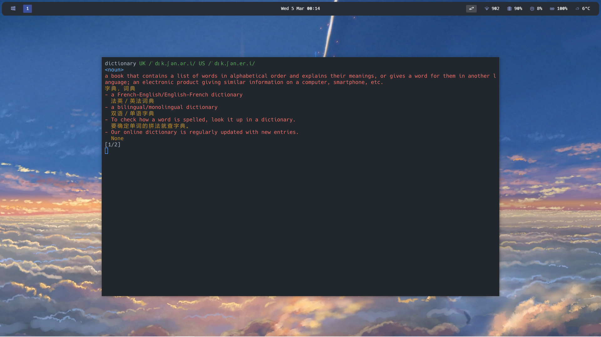

# Dict 

这是一个为了规避掉繁琐的网页操作，而开发的基于tui的命令行单词查询工具。你可以使用类似 Vim 的按键操作逻辑，通过简洁高效的按键组合查询单词，浏览单词释义, 并且有着较为美观的单词高亮。

同时，采用了轻量级数据库 sqlite 存储查询的单词，可以方便日后复习。



## 主要功能
1. **单词查询**  
   用户可以通过命令行输入单词，查询其发音、释义等信息。
2. **类 Vim 操作体验**  
   提供类似 Vim 的交互式界面，用户可以通过按键操作（如 `h`、`l`、`n`、`q`）浏览单词的不同释义、切换单词或退出程序。
3. **记录查询历史**  
   将查询过的单词及其释义保存到数据库中，方便后续复习。
4. **多平台支持**  
   支持 Windows 和类 Unix 系统（如 Linux、macOS）。

## 操作方式

程序没有复杂的操作，如果你已经熟悉 vim ，相信你可以轻松上手

### 启动程序
确保 Python 环境以及所需要的库已安装, 输入一下命令运行程序
```bash
python dict.py
```

### 查询单词
程序启动后，会在命令行提示输入单词。输入单词后按回车键查询，例如：
```
Query: hello
```

### 操作
查询结果会显示单词的发音和释义。用户可以通过以下类 Vim 按键操作进行交互：

| 按键 | 功能描述 |
|------|----------|
| **数字键** | 直接跳转到对应的释义序号（如输入 `1` 跳转到第1个释义） |
| **h** | 查看上一个释义 |
| **l** | 查看下一个释义 |
| **n** | 跳过当前单词，返回查询界面 |
| **q** | 退出程序 |

### 退出程序
在查询界面输入 `q` 或在交互界面按下 `q` 键即可退出程序。

## 项目结构
- `words.py`：负责查询单词的发音和释义。
- `db.py`：负责将查询的单词记录到数据库中。
- `tui.py`：提供文本用户界面（TUI），采用类 Vim 操作逻辑，用于显示单词信息和处理用户输入。
- `main.py`：程序入口文件，整合以上模块实现核心功能。


## 贡献
欢迎提出改进建议或提交代码修复，共同完善这个工具。